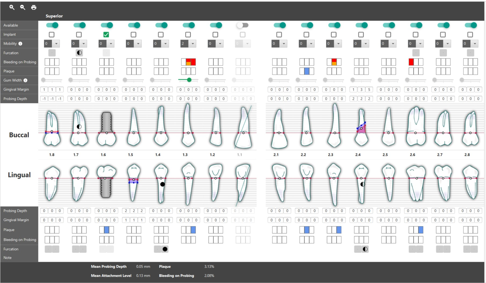
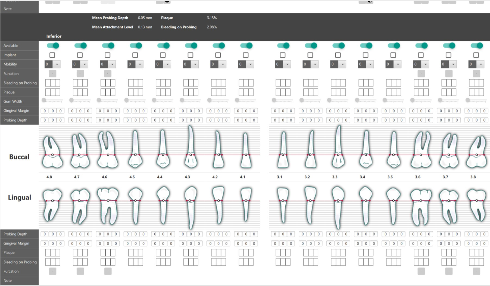

# Periodontal-Chart-JavaFX
A dental chart application built using JavaFX.

  
  

## Built With  
&nbsp;&nbsp;&nbsp;&nbsp;**Java** - The Main Programming Language and Framework.  
&nbsp;&nbsp;&nbsp;&nbsp;**JavaFX** - Software Platform for creating and delivering desktop, mobile and web applications.   
&nbsp;&nbsp;&nbsp;&nbsp;**Netbeans** - Java IDE.  
&nbsp;&nbsp;&nbsp;&nbsp;**Maven** - Dependency Management.  

## Authors  
   **Muhammad Ali Arafah** - find me on : [Twitter](https://twitter.com/ZaTribune), [LinkedIn](https://www.linkedin.com/in/zatribune).  
   
## Acknowledgments   
   Thanks to [alejo8591](https://github.com/alejo8591/periodontal-chart) , As I used the dental photos that he provided, as well as the chart mechanisms and functionaities.
