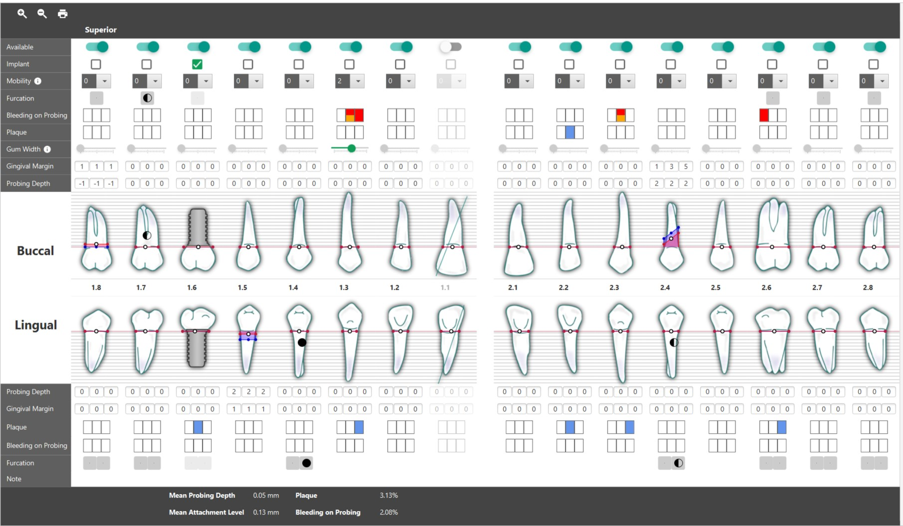
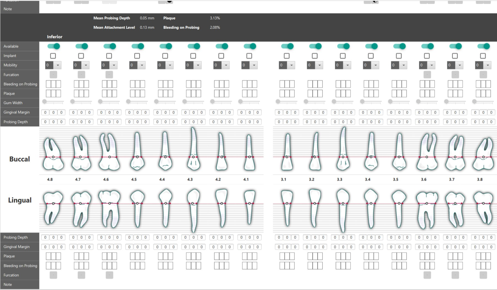

<div align="center">

# 🦷 JavaFX Periodontal Chart


**A comprehensive desktop application for dental professionals to record, track, and visualize periodontal health metrics with precision and ease.**

</div>

## Technology Stack
- **Language**: Java
- **GUI Framework**: JavaFX
- **Build Tool**: Maven
- **Additional Libraries**: JFoenix, ControlsFX, Jackson, JFXtras

---

## Features

### Tooth Data Tracking (Per Tooth)
Each of the 32 teeth tracks:
- **Availability**: Toggle tooth available/unavailable
- **Implant Status**: Mark if tooth is an implant
- **Mobility**: Scale from -3 to +3 (indicating tooth mobility level)
- **Furcation (Fork)**: 3 levels (0-3) for different teeth
- **Bleeding on Probing (BOP)**: 3 measurement points per tooth (0-2 scale)
- **Plaque**: 6 measurement points (0-1 binary scale)
- **Gum Width**: Slider value 50-200
- **Gingival Margin**: 6 text input fields (ranging from -10 to +10)
- **Probing Depth**: 6 text input fields (ranging from -10 to +10)
- **Selected Circle**: Tracking which circle is selected on the chart visualization

### Visualization
- **Dental Images**: Upper and lower views of each tooth
    - Normal tooth, cross (unavailable), implant variants
- **Gingival Margin & Probing Depth**: Graphical line chart overlaid on tooth images
    - Red circles/path for gingival margin
    - Blue circles/path for probing depth (margin + depth)
- **Fork Visualization**: Moon phases (new, quarter, full) representing furcation levels

<p align="center">
  
  
</p>

## How to Run

To run the application, ensure you have **Java 21+** and **Maven** installed, then execute:

```bash
mvn javafx:run
```

This command will compile the project and launch the dental chart application.  

---

## Acknowledgments   
   Thanks to [alejo8591](https://github.com/alejo8591/periodontal-chart) , As I used the dental photos that he provided, as well as the chart mechanisms and functionaities.
   
## Authors
[](https://linkedin.com/in/zatribune)
